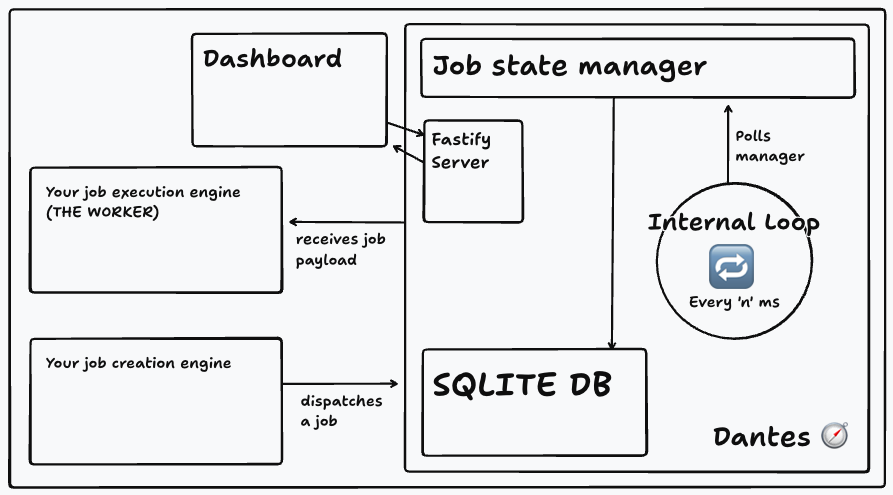
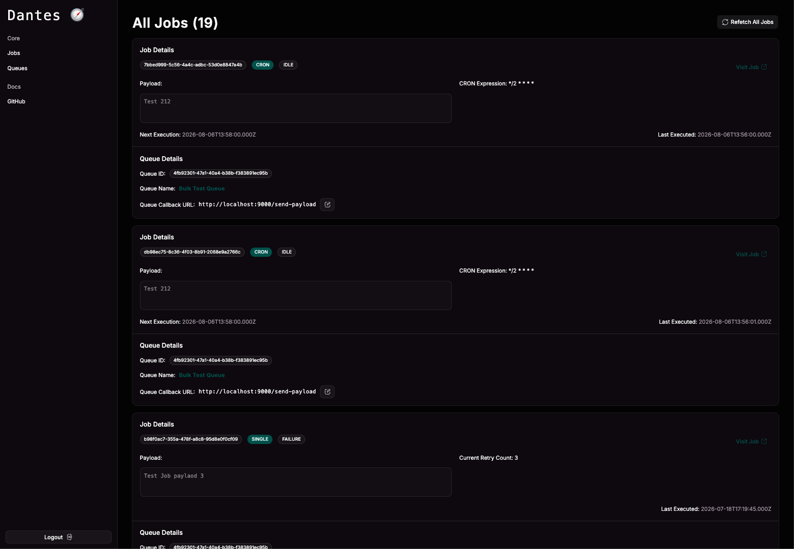
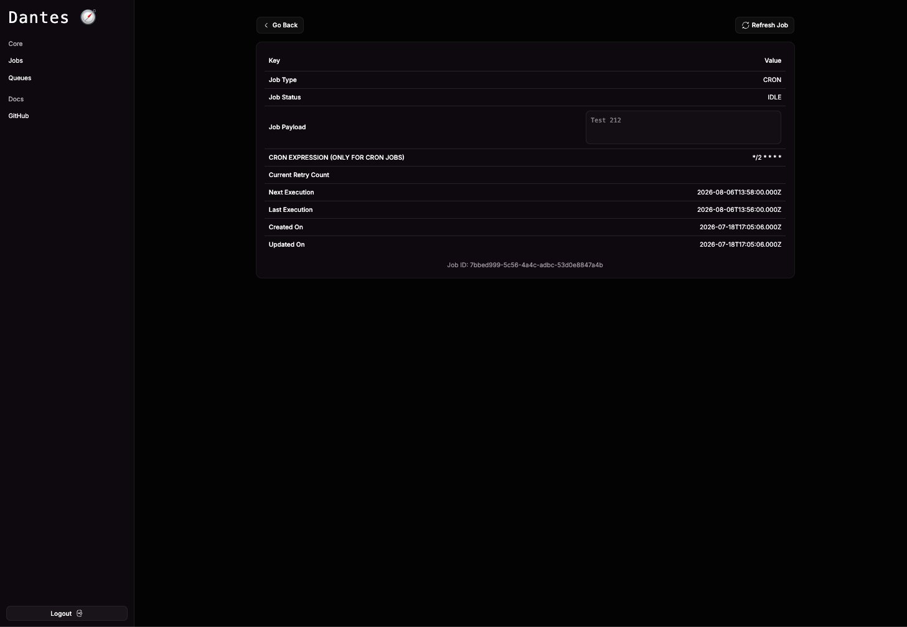
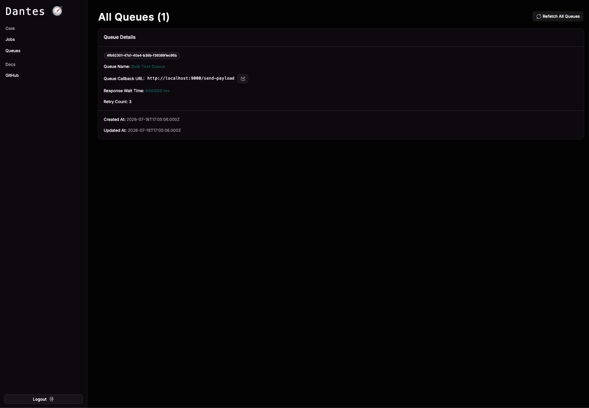

<p align="center">
  
</p>

# Dantes 🧭

Dantes is a fully self-hostable, zero dependency, extremely quick and lightweight, asynchronous background job orchestrator with a built in dashboard.

Deploy it once, and use in any language.

## Table of contents

- [Dantes 🧭](#dantes-)
  - [Table of contents](#table-of-contents)
  - [What is Dantes?](#what-is-dantes)
  - [Setup](#setup)
    - [1. Clone dantes](#1-clone-dantes)
    - [2. Run the setup script](#2-run-the-setup-script)
    - [3. View the server logs](#3-view-the-server-logs)
  - [How it works](#how-it-works)
    - [Creating a queue:](#creating-a-queue)
    - [Creating a job:](#creating-a-job)
  - [The dashboard](#the-dashboard)
  - [Future Improvements](#future-improvements)
  - [Contributing](#contributing)

## What is Dantes?

Dantes is an asynchronous job orchastrator, with quick low-effort setup, giving you complete control over the jobs you want to run. Written in typescript from scratch, the goal has been to deploy and leave a self-sufficient, atomic and durable orchastrator engine, so that you can focus on building better workers, not managers.

Dantes comes with out-of-the-box support for retries, scheduled jobs, and CRON jobs. You can trace through time all executions of a job, payloads and success and error states. It is heavily configurable to your needs, simply by modifying the environment, or customising your Queue.

## Setup

#### 1. Clone dantes

```sh
git clone https://github.com/iammohitvs/dantes.git

cd dantes
```

#### 2. Run the setup script

```sh
chmod +x setup.sh

./setup.sh
```

#### 3. View the server logs

```sh
docker logs -f -t --since "$(date -u +%Y-%m-%dT%H:%M:%SZ)" dantes-server
```

## How it works

Dantes runs on the well-known concept of Queues and Jobs. Think of Queues like an overall blueprint of the job, and think of Jobs as an execution defined by the queue it is part of. Queues host information like what worker must be hit, how many times a retry must happen, how long to wait for a response. Jobs hold more execution level information, like when to execute, what payload to deliver, scoped retry counts, and execution history. There are 3 types of jobs dantes can manage: Jobs requiring immediate scheduling, Jobs that require scheduling sometime in the future, CRON Jobs.

Dantes - by default - will at once send out 5 jobs to be executed by their workers. This is a configurable number. The jobs execute, and then replaced by the next job. An internal loop schedules these jobs, and a mutex makes sure no two jobs are confused inside the database, ensuring isolation while picking up jobs. When picking up jobs, dantes will execute them in this order: CRON Jobs -> Jobs that are scheduled to be executed at the moment -> Jobs that are unscheduled (immediate execution)

Internally, Dantes has a running loop, that searches for jobs every 500 ms, when there is space to accommodate one, and pushes it out to the worker. The worker must respond within 60 seconds, or the job is marked as timed-out. Again, all these numbers are configurable. Dantes is built to be very customisable.

Dantes is very very quick, with millisecond response times imminent. It uses an SQLite DB on-disk for super fast reads and writes on low system requirements, and fastify as the backend server. The main core logic is purely Typescript.

<p align="left">
  
</p>

### Creating a queue:

```sh
curl -X POST "https://your-dantes-domain/queue/" \
  -H "Content-Type: application/json" \
  -d '{
    "name": "Test Queue",
    "callbackUrl": "https://your-worker/job-execution-endpoint"
  }'

# 1. the response returns your queueId (keep it handy)
# 2. your callbackUrl must have a post method attached to it, to receive the payload
```

### Creating a job:

```sh
# For immediate execution
curl -X POST "https://your-dantes-domain/job/" \
  -H "Content-Type: application/json" \
  -d '{
    "payload": "{\"test\": \"payload\"}",
    "queueId": "4fb92301-47a1-40a4-b38b-f383891ec95b"
  }'
```

```sh
# Schedule a one-time job
curl -X POST "https://your-dantes-domain/job/" \
  -H "Content-Type: application/json" \
  -d '{
    "payload": "{\"test\": \"payload\"}",
    "queueId": "4fb92301-47a1-40a4-b38b-f383891ec95b",
    "nextExecution": 1786023000000
  }'
```

```sh
# CRON jobs
curl -X POST "https://your-dantes-domain/job/" \
  -H "Content-Type: application/json" \
  -d '{
    "payload": "{\"test\": \"payload\"}",
    "queueId": "4fb92301-47a1-40a4-b38b-f383891ec95b",
    "cronExpression": "*/2 * * * *",
    "type": "CRON"
  }'
```

## The dashboard

A dashboard (Vite + react-router) is your insight into the execution of all of your jobs, to view and manage how and why they may fail.

<div style="display: flex; flex-direction: row; flex-wrap: nowrap; gap: 4px;">
    <p align="left" style="flex: 1;">
        
    </p>
    <p align="left" style="flex: 1;">
        
    </p>
    <p align="left" style="flex: 1;">
        
    </p>
</div>

## Future Improvements

1. The Dashboard UI (too simple as of now)
2. Graceful shutdowns for running jobs (on server crashes)

## Contributing

Dantes will be worked on and improved every now and then, and is otherwise very welcome to contributions.

Dantes has been built from the ground up, <b>WITHOUT ANY AI</b>, and will remain so for the foreseeable future. All contributions must be made in light of that knowledge.
AI is amazing tooling to move forward engineering, but this is a project built solely to scratch an internal itch for writing code to result in self-fulfillment and joy.

Thank you, and please star us ❤️ 🤗
